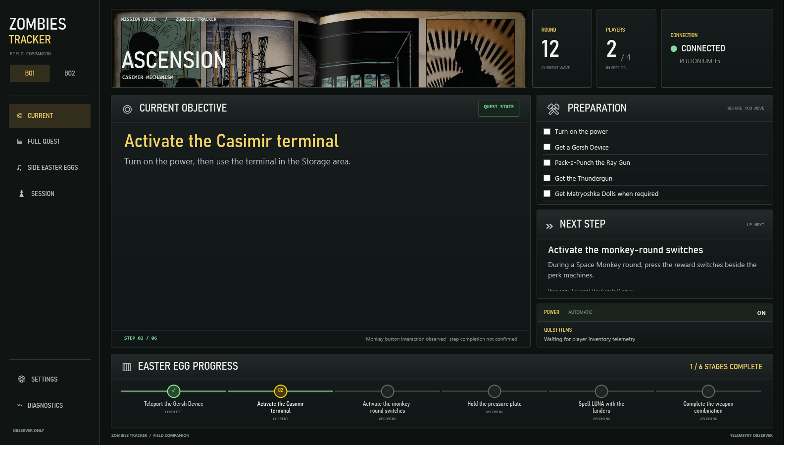
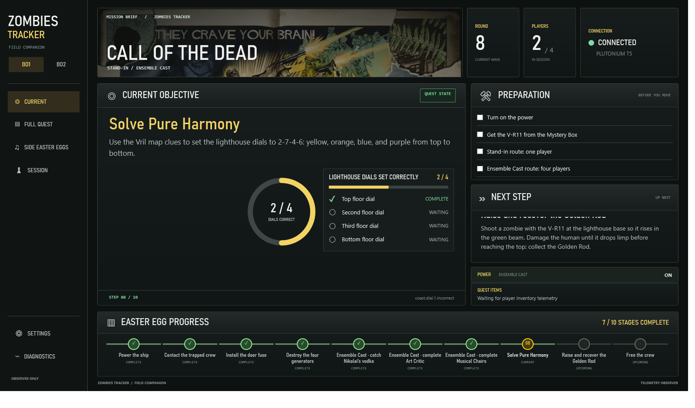
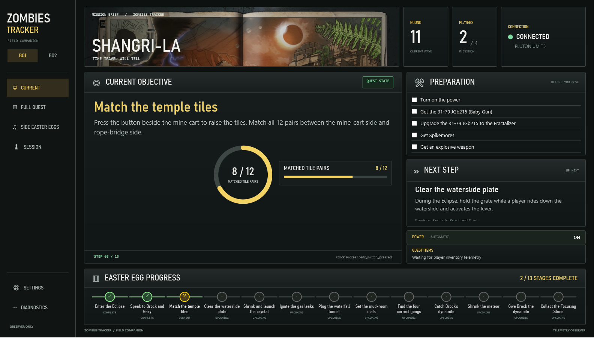
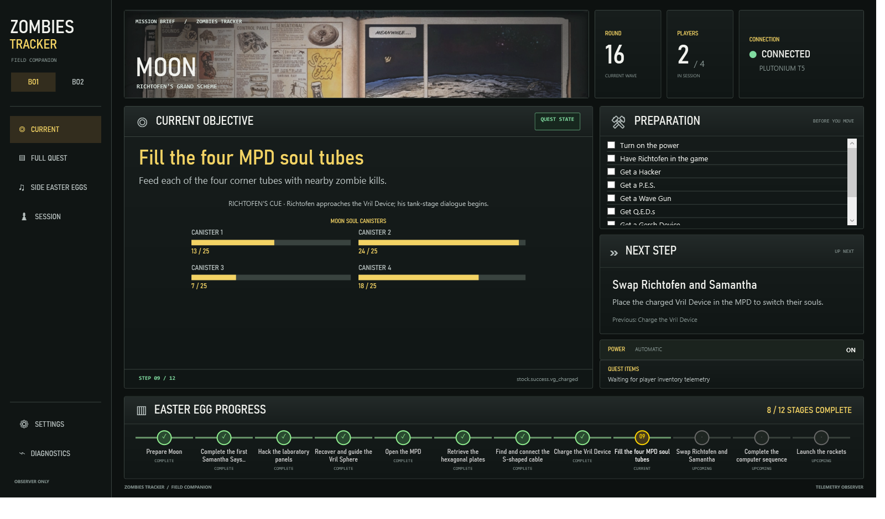
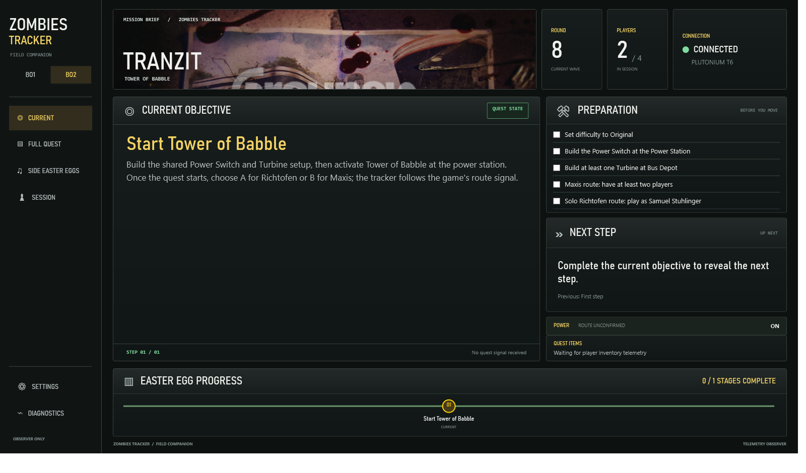
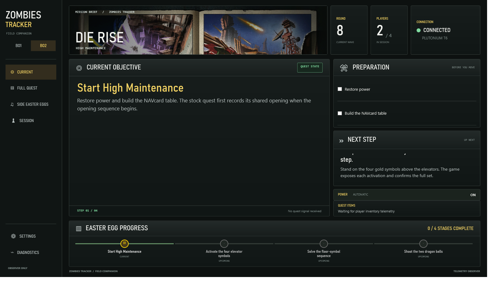
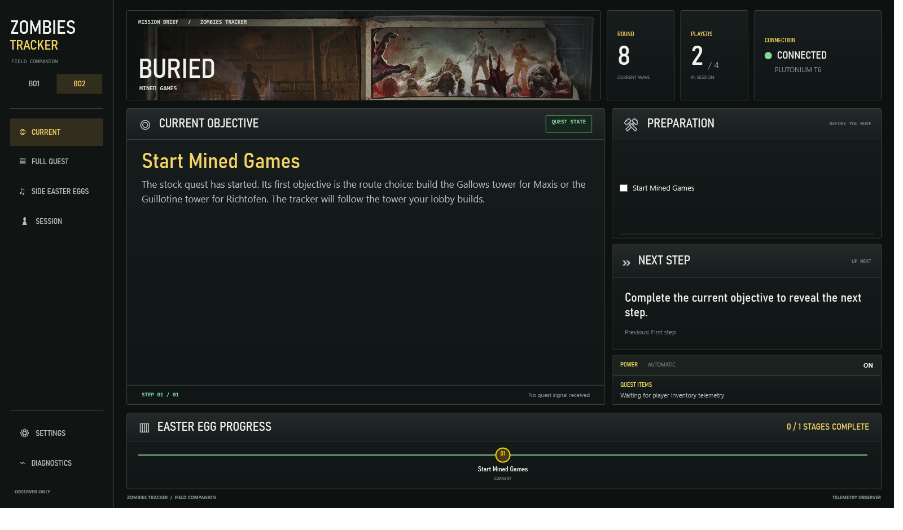
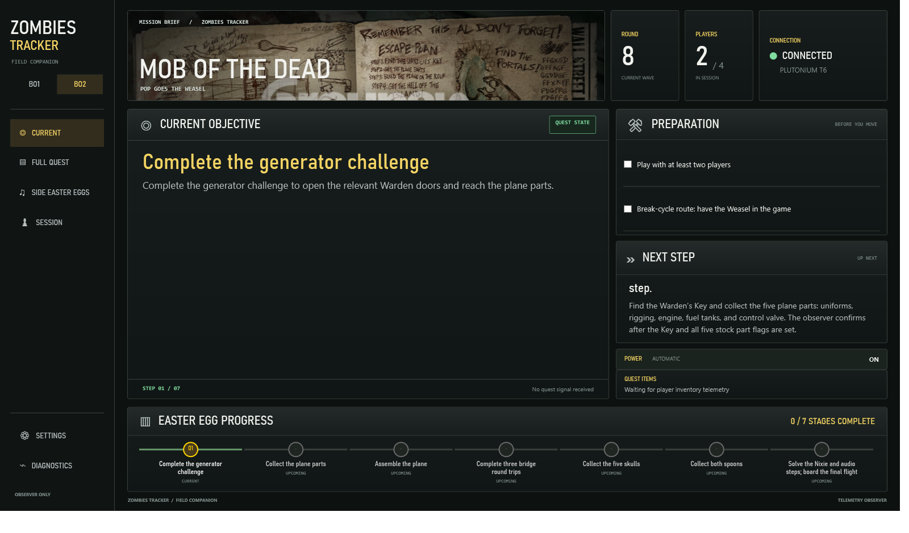
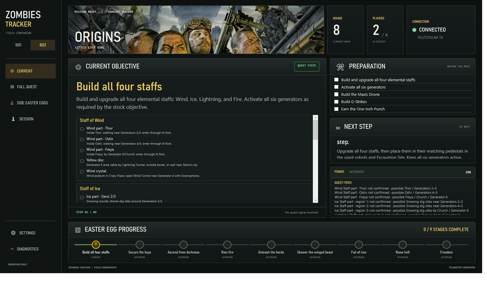

# Blops EE Tracker

A Windows desktop companion for the Black Ops Zombies main Easter Eggs on four BO1 maps and five BO2 maps. The desktop client follows Plutonium T5 and T6 game-state events written by map-scoped GSC observers.

## Screenshots

These current-app captures use replay fixtures to show the tracker UI for each supported map. They demonstrate presentation and map content, not live-match observer verification.

### Black Ops 1

| Ascension | Call of the Dead |
| --- | --- |
|  |  |

| Shangri-La | Moon |
| --- | --- |
|  |  |

### Black Ops 2

| TranZit | Die Rise | Buried |
| --- | --- | --- |
|  |  |  |

| Mob of the Dead | Origins | |
| --- | --- | --- |
|  |  | |

## Install

Download the latest portable desktop package and the separate T5/T6 GSC observer package from [GitHub Releases](https://github.com/anxiousintrovert/blops-ee-tracker/releases/latest). The desktop package is self-contained for Windows x64 and includes map data, samples, and observer scripts/install helpers.

Follow [INSTALL.md](INSTALL.md) to install the app and observers. Source builds and contributor notes are in [docs/development.md](docs/development.md).

## What it tracks

- Map, round, player count, power, and connection state.
- Script-defined main-quest objectives and their original ordering.
- Confirmed objective counters and checkpoints when the active map observer exposes them.
- Moon soul-canister progress, Samantha Says colors, Ascension's LUNA sequence, and the pressure-pad timer.
- BO2 main quests and map-scoped quest inventory/part pickup observations from stock callback hooks.
- Map-specific manual/observer-backed Side Easter Egg checklists.

Quest flows remain data-driven in `data/bo1-main-quest-flows.json`; the UI does not define a second quest sequence. The game scripts remain authoritative for step completion. Ascension has live observer evidence. Call of the Dead, Shangri-La, and Moon observers are installed and source-reviewed but still need more live-match verification. See [the verification record](docs/live-verification.md).

The app reads a local session file on the same computer. It does not sync a completed step to another player's desktop over the network. T6 callback hooks compile and are source-reviewed but still need private-match verification; individual loose-part hooks are not implemented for BO1, and Mob key/plane part flags are team-level only.

## Map artwork

The decorative map banners are original AI-generated environment artwork created for this app. They contain no game logos or UI elements; source and usage notes are in Settings and [the UI notes](docs/ui-layout.md).

## License and trademarks

This initial public repository does not include a software license. Public visibility does not grant permission to redistribute or relicense the project. “Call of Duty” and related game names and marks belong to their respective owners. This is a fan-made companion and is not affiliated with or endorsed by Activision or Plutonium.
