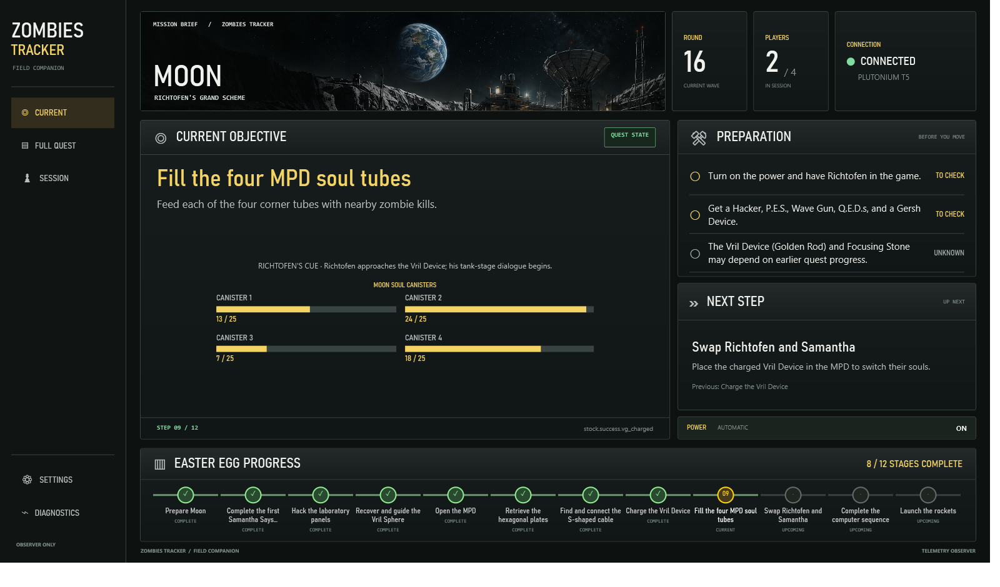

# Blops EE Tracker

A Windows desktop companion for the Black Ops Zombies main Easter Eggs on Ascension, Call of the Dead, Shangri-La, and Moon. The desktop client follows Plutonium T5 game-state events written by four map-scoped GSC observers.

## Install

Download the latest portable desktop package and the GSC observer package from [GitHub Releases](https://github.com/anxiousintrovert/blops-ee-tracker/releases/latest). The desktop package is self-contained for Windows x64 and includes the observer scripts and install/uninstall helpers.

Follow [INSTALL.md](INSTALL.md) to install the app and observers. Source builds and contributor notes are in [docs/development.md](docs/development.md).

## What it tracks

- Map, round, player count, power, and connection state.
- Script-defined main-quest objectives and their original ordering.
- Confirmed objective counters and checkpoints when the active map observer exposes them.
- Moon soul-canister progress, Samantha Says colors, Ascension's LUNA sequence, and the pressure-pad timer.

Quest flows remain data-driven in `data/bo1-main-quest-flows.json`; the UI does not define a second quest sequence. The game scripts remain authoritative for step completion. Ascension has live observer evidence. Call of the Dead, Shangri-La, and Moon observers are installed and source-reviewed but still need more live-match verification. See [the verification record](docs/live-verification.md).

The app reads a local session file on the same computer. It does not sync a completed step to another player's desktop over the network.

## Map artwork

The decorative map banners are original AI-generated environment artwork created for this app. They contain no game logos or UI elements; source and usage notes are in Settings and [the UI notes](docs/ui-layout.md).

## License and trademarks

This initial public repository does not include a software license. Public visibility does not grant permission to redistribute or relicense the project. “Call of Duty” and related game names and marks belong to their respective owners. This is a fan-made companion and is not affiliated with or endorsed by Activision or Plutonium.
